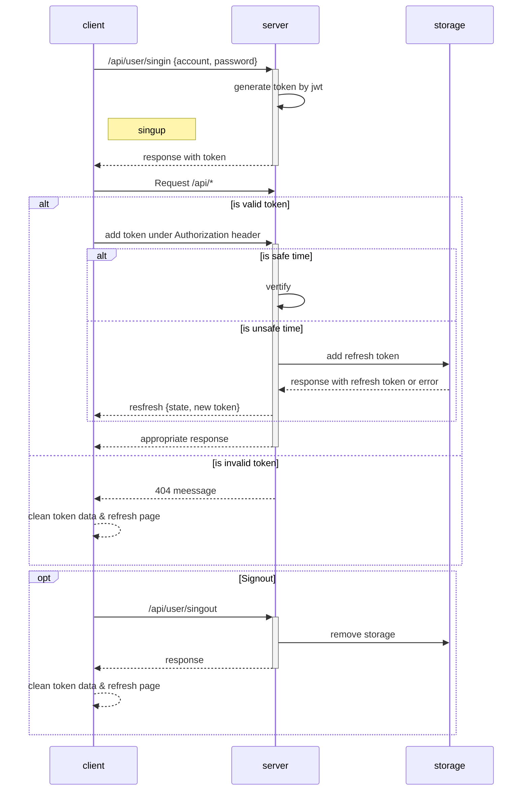
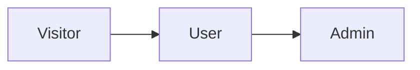
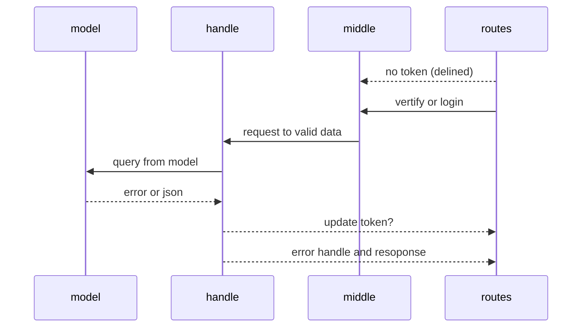
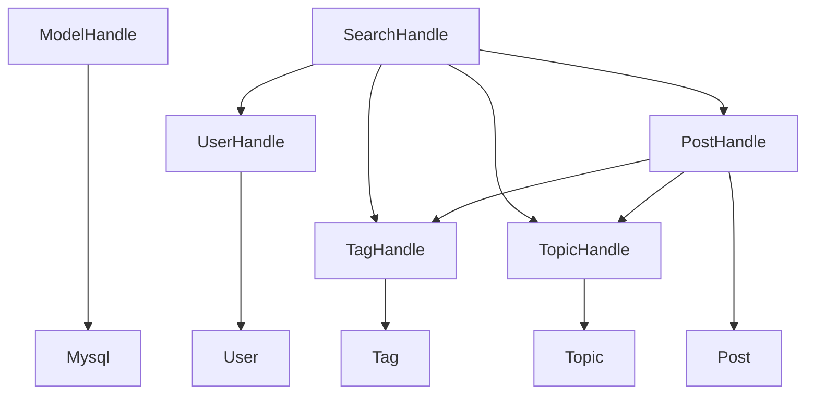
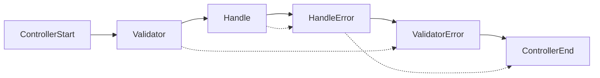
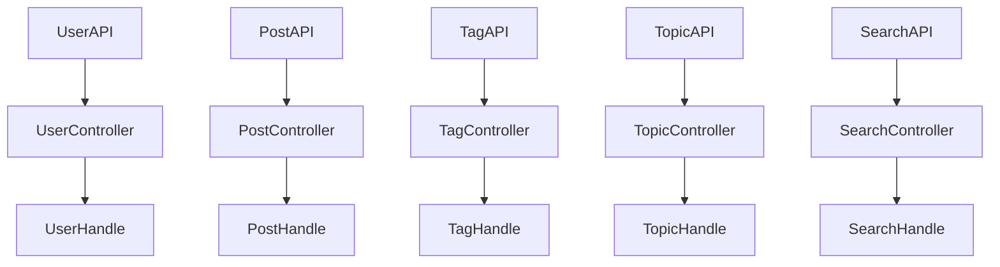
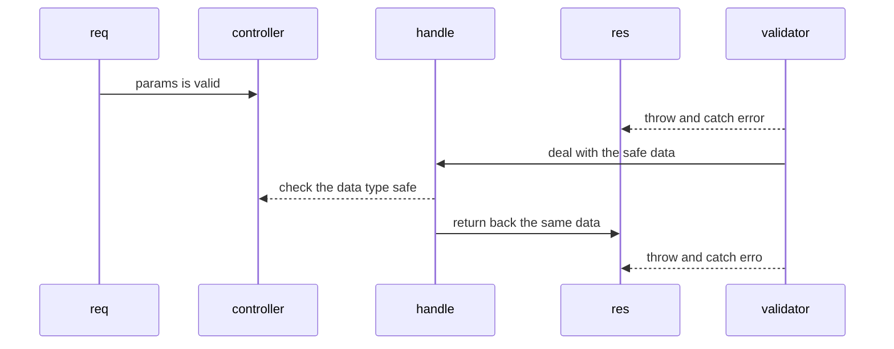

# Backend design

## language Specification

| Module | Specification |
|:------:|:-------------:|
| server |   CommonJs    |

Choose common js because of the better echo system. Use ESM will cause error in some automatic build tools.

## Basic set up

### token design
 
To avoid anonymity visit on a heavy api, such as two table select by union or join and update large blob assets would
be quite dangerous. jwt with simple info could limit visits.

Token design:

| Data | Datatype |   Usage   |
|------|:--------:|:---------:|
| id   |  number  |  User Id  |

Weakness: When a token expired, api will directly decline user request. Here we designed a two layer authentication to
improve user experience.

### user permission

|          | Admin | User | Visitor |
|:---------|:-----:|:----:|:-------:|
| /admin/* |   X   |      |         |
| /api/*   |   X   |  X   |    X    |
| /*       |   X   |  X   |    X    |    

- admin -> /api*, /admin*
- user -> /api*
- visitor -> /* exclude /admin* and /api/*

3 level design would be good enough to.

### Structure design

