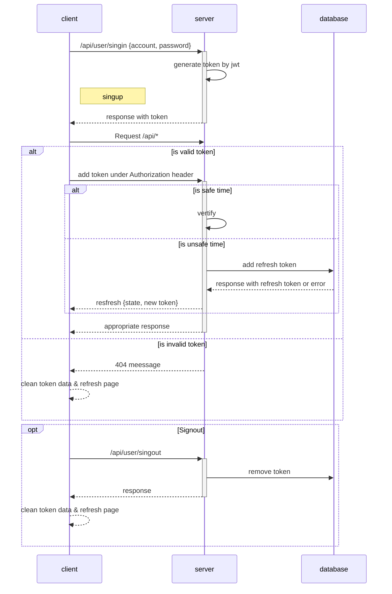
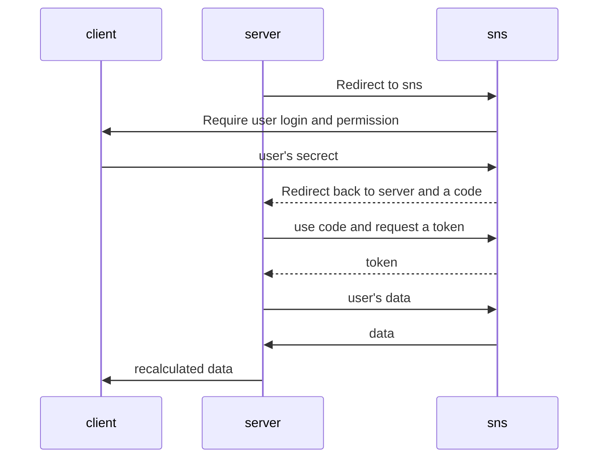

# Auth API

## Analyze

The auth apis provided regular auth and third party auth. The regular auth will do the **signin** (_POST_),
**signup** (_POST_), **reset** (_PUT_) action and get a token in three different action. The third party
auth will get a token, authorization persistence should handle with third party oauth2.0 provider.  

Auth table should require **auth_id**, **auth_name** **auth_email**, **auth_token**, **auth_type**(local,
sns etc,). In github, user contain two different method, user could show auth email(bind with third party)
or github email `balabalabala@users.noreply.github.com`. Here we want to do the same thing, but leave the
local email empty.

## Procedure

### Local Auth



### Third Party Auth



GitHub configuration steps:

1. Login to **[GitHub](https://github.com/)**.
2. Settings => Developer settings => OAuth Apps => Register a new application
3. Configure follows GitHub guidance and get **Client-ID** and **Client-Secret**

Combine url together and redirect for user

```
REFERER
https://github.com/login/oauth/authorize?
    scope=user:email&
    client_id={Client-ID}&
    redirect_uri={ShaderLab-API}
```

Then, user will do something and get a **Code** from GitHub

```
http://{ShaderLab-API}?code=BALABALABALA
```

which will handle in auth api at _ctx.request.query.code;_

Require token from GitHub

```
POST
https://github.com/login/oauth/access_token?
    client_id={Client-ID}&
    client_secret={Client-Secret}&
    code=${Code}
headers: {
  accept: "application/json"
}
```

and get a **accessToken** from GitHub

Then get email _username@github.com_ from GitHub

```
GET
https://api.github.com/user
headers: {
    accept: "application/json",
    Authorization: `token ${accessToken}`
}
```

Google configuration steps:

1. Login to **[Google](https://console.cloud.google.com)**.
2. Left navbar => API and services => OAuth consent screen
3. Configure follows Google guidance and get **Client-ID** and **Client-Secret**

**Special way**: use Google's [library](https://developers.google.com/identity/protocols/oauth2/web-server#node.js_1)

Combine url together and redirect for user
[official guidance](https://developers.google.com/identity/protocols/oauth2/web-server#creatingclient)

```
REFERER
https://accounts.google.com/o/oauth2/v2/auth?
    scope=https://www.googleapis.com/auth/userinfo.email&
    include_granted_scopes=true&
    response_type=token&
    redirect_uri={ShaderLab-API}&
    client_id={Client-ID}
```

Then, user will do something and get a **Code** from Google

```
http://{ShaderLab-API}?code=BALABALABALA
```

which will handle in auth api at _ctx.request.query.code;_

Require token from Google

```
POST
https://oauth2.googleapis.com/token?
    client_id={Client-ID}&
    client_secret={Client-Secret}&
    code=${Code}&
    grant_type=authorization_code
headers: {
  accept: "application/json"
}
```

and get a **accessToken** from Google

```
GET
https://www.googleapis.com/oauth2/v2/userinfo
headers: {
    accept: "application/json",
    Authorization: `Bearer ${accessToken}`
}
```
