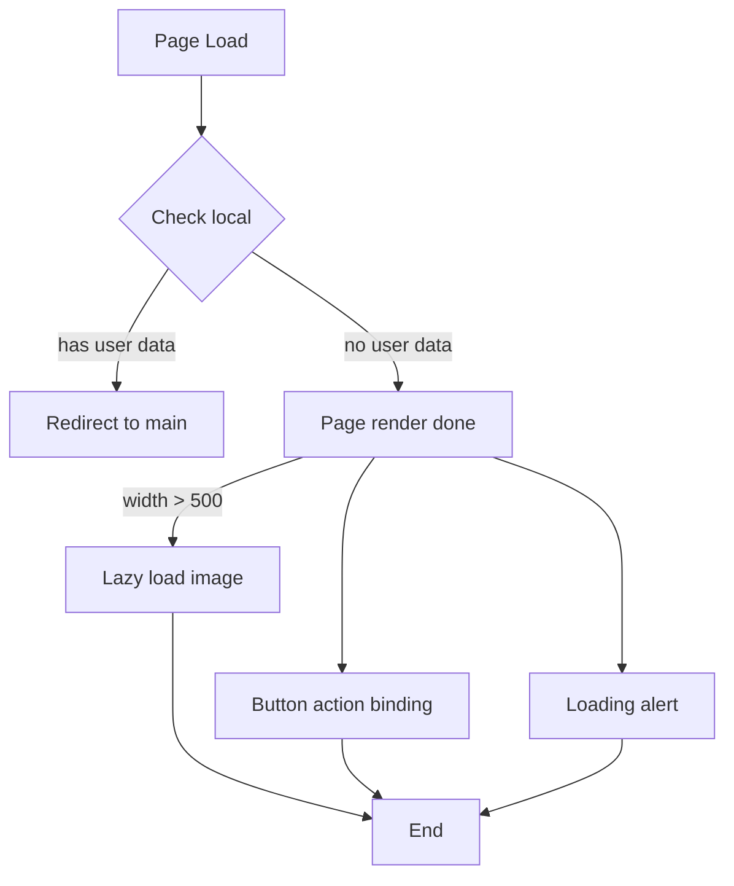

## Feature

The core feature of login page should be **register** and **login** feature. In the web page, should
have entrance to main page, Consider to use navigate title. Register could use two different
type of account input, email or pure string and password consider have a limit 64 length.

### Structure design

Background, Navigation Bar, Main Panel.

### Source map

|                |    CSS    |    Naming     | Interop | Mobeile | Desktop |
|----------------|:---------:|:-------------:|:-------:|:-------:|:-------:|
| Background     | login.css | sl-background |  None   | Disable | Enable  |
| Navigation bar |  nav.css  |    sl-nav     |  True   | Disable | Enable  |
| Main Panel     | panel.css |   sl-panel    |  True   | Enable  | Enable  |

### Interop requirement

|        Name        |   Selector   |
|:------------------:|:------------:|
| Main page entrance |  .nav-label  |
|     Input form     | #panel-input |
|  Register Button   |  .register   |
|    Login Button    |    .login    |

## Analyze

Consider use regular rendering because the page only contain few simple DOM tree. So, it could draw all
the component once page loaded.

Drawing level consideration:

### Loading step

If user already registered, this page should directly redirect to main page.
When build consider direction inline the script under header.

### API interop

| Feature      |                   Request                    |  Response   |
|:-------------|:--------------------------------------------:|:-----------:|
| Page Loading |         GET api/img/random (Static?)         | RETURN blob |
| Register     | POST (Account: string16, password: string32) | RETURN JSON |
| Login        | POST (Account: string16, password: string32) | RETURN JSON |
