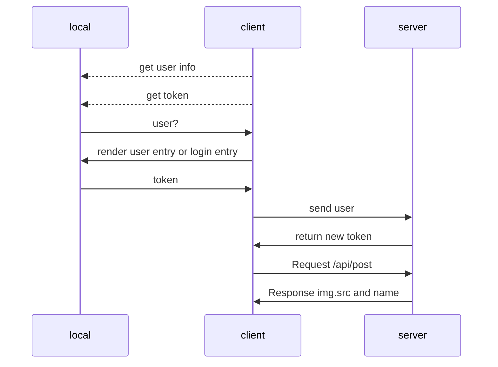
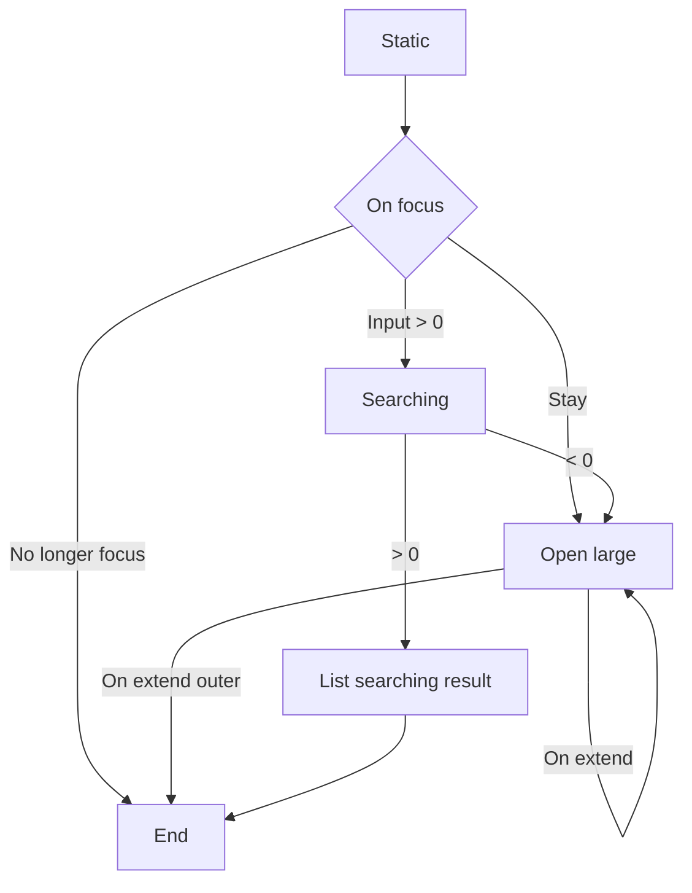
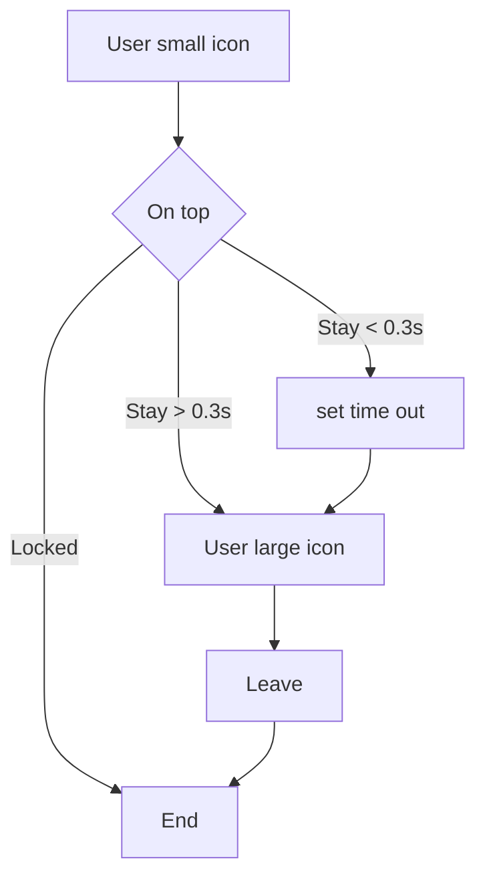

## Feature

The core feature of home page should have three key features: search, user, preview features. In the web page,
should have entrance to editor page and login page (conditional). 

Structure design: Navigation, Layout

Navigation: search, filter and user control.

|             |    CSS     |  Naming   | Interop | Mobeile | Desktop |
|-------------|:----------:|:---------:|:-------:|:-------:|:-------:|
| Navigation  |  nav.css   |  sl-nav   |  True   | Enable  | Enable  |
| Main Layout | layout.css | sl-layout |  True   | Enable  | Enable  |

## Analyze

This page should contain 50% functions of the application, including search, user, info.

Navigation Bar:

Elements under navigation bar has two stage:
- normal -> mini icon.
- large -> panel and large icon.

Left Entry:

|                       |     CSS      |   Naming    | Interop | Mobeile | Desktop |
|-----------------------|:------------:|:-----------:|:-------:|:-------:|:-------:|
| Home Entry            | nav left.css | sl-nav__bar |  True   | Disable | Enable  |
| Login Entry -> shared | nav left.css | sl-nav__bar |  True   | Enable  | Disable |

Right Entry:

|                       |      CSS      |  Naming     | Interop | Mobeile | Desktop |
|-----------------------|:-------------:|:-----------:|:-------:|:-------:|:-------:|
| Login Entry -> shared | nav right.css | sl-nav__bar |  True   | Enable  | Disable |
| Message Entry         | nav right.css | sl-nav__bar |  True   | Disable | Enable  |
| History Entry         | nav right.css | sl-nav__bar |  True   | Disable | Enable  |
| Upload Entry          | nav right.css | sl-nav__bar |  True   | Disable | Enable  |

Main Layout:

|           |        CSS        |        Naming        | Interop | Mobeile | Desktop |
|-----------|:-----------------:|:--------------------:|:-------:|:-------:|:-------:|
| Recommend |  nav suggest.css  | sl-layout__recommend |  True   | Enable  | Enable  |
| Holder    | nav container.css |  sl-layout__holder   |  True   | Enable  | Enable  |

Layout should get the data from database under **ranking**.

| Feature      |         Request          |   Response   |
|:-------------|:------------------------:|:------------:|
| Page Loading |      GET /api/post       | RETURN JSON  |
|              |   GET /api/user/vertify  | RETURN token |
| Search       |    GET /api/post/tag     | RETURN JSON  |

Search panel implement:

User avatar icon implement:

