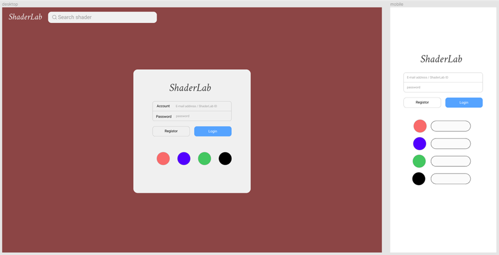
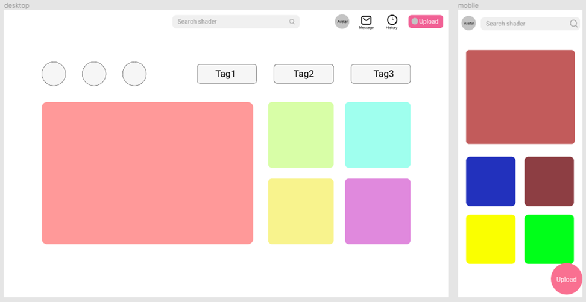
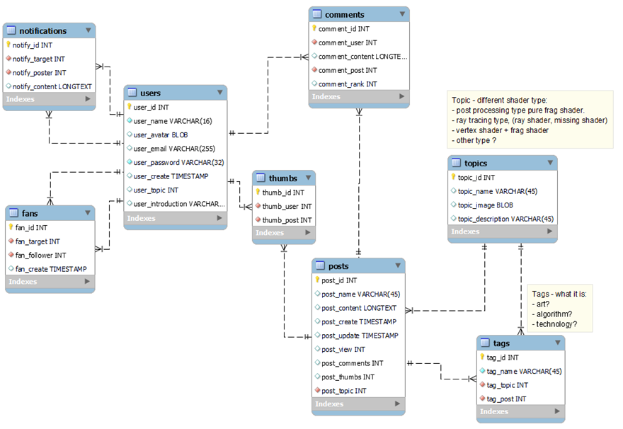

# Shader Lab

----------------------------------------

## 1.	Introduction

Shader Lab designed as a bulletin board system based shader assets repository aiming for fast and simple shader editing, sharing, discussion and advising in one platform.
In this project, the main schema of the web styling will follow win 11  rounded corners and our team will implement:
The user system including follower management and message notification;
Basic posts system including rank, vote, tag, auto recommend;
And a shader editor with real-time renderer based on WebGL including 3d models rendering with vertex shader and fragment shader and the post processing like pure quad with double triangle rendering with fragment shader only.

## 2.	User Interface

Prototype design by Figma:

+ Login Panel

+ Main Panel

+ Editor Panel

## 3.	Database

+ Users - login and logon, fundamental data.

+ Posts - shaders data, comments, and tag system.

## 4.	Development plans

Tools:

+ Frontend - native JS + HTML + CSS.

+ Backend - crate prototype by Node.js under Express.js framework.

+ database - MySQL for data collection.

Division of work:

+ Member1 - UI Design and Layout.

+ Member2 - Layout self-adaptive and MySQL database setup.

+ Member3 - Coding and testing.

+ Member4 - Cooperate with M3 on coding.
